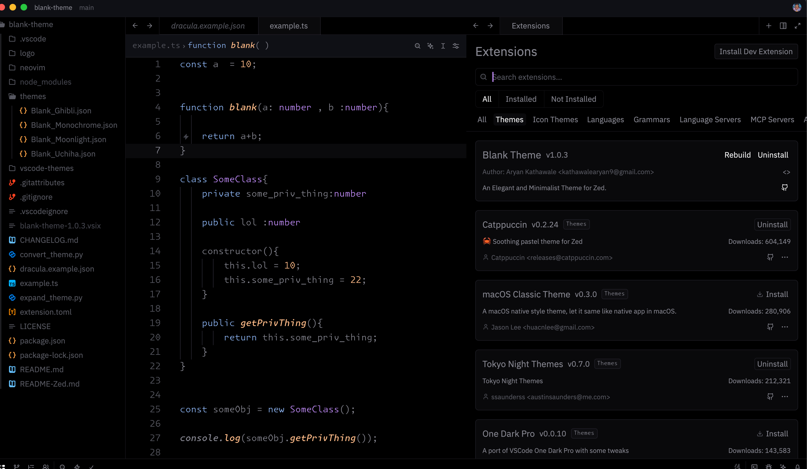
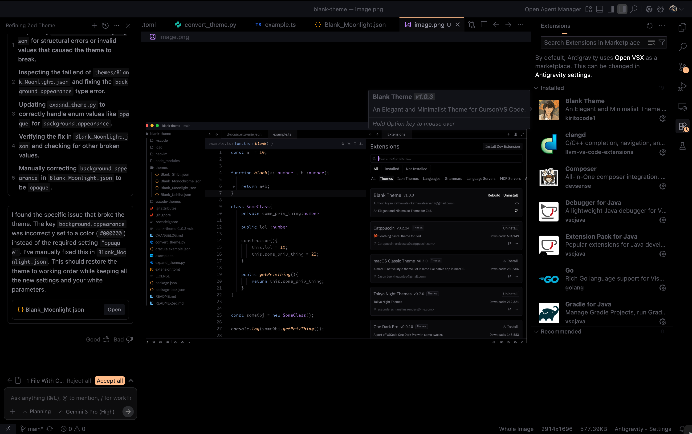

# BLANK THEME

A theme for Visual Studio Code with a focus on simplicity and readability.

## Now available for Zed Editor!

We have ported the Blank Theme to Zed! experience the same elegance with high performance.
See [README-Zed.md](README-Zed.md) for installation instructions.

## Now available in Antigravity!

Experience the future of coding with Blank Theme in Antigravity.

# Blank Moonlight (Preferred)

# Blank Monochrome

# Blank Ghibli

# Blank

## Features

- Minimal and clean design
- High contrast colors
- Customizable colors
- Support for multiple color schemes
- Support for multiple file types
- Support for multiple file icons
- Support for multiple file extensions

Experience the future of coding with Blank Theme in Antigravity.

## Installation

1. Install the extension from the [Visual Studio Marketplace](https://marketplace.visualstudio.com/items?itemName=BlankTheme.blank-theme)
2. Open the command palette (Ctrl+Shift+P) and select "Preferences: Color Theme"
3. Select "Blank Moonlight"

## Customization

You can customize the theme by editing the `settings.json` file.
To do this, open the command palette (Ctrl+Shift+P) and select "Preferences: Open Settings (JSON)".
Then, edit the `settings.json` file.

### Colors

The theme supports the following colors:

| Color | Description |
| --- | --- |
| editor.background | Background color of the editor |
| banner.background | Background color of the banner |
| menu.background | Background color of the menu |
| sideBar.background | Background color of the side bar |
| statusBar.background | Background color of the status bar |
| panel.background | Background color of the panel |
| minimap.background | Background color of the minimap |
| badge.background | Background color of the badge |
| terminal.background | Background color of the terminal |
| tab.hoverBackground | Background color of the tab when hovered |
| activityBar.background | Background color of the activity bar |
| quickInput.background | Background color of the quick input |
| peekViewEditor.background | Background color of the peek view editor |
| peekViewResult.background | Background color of the peek view result |

### Color Schemes

The theme supports the following color schemes:

| Color Scheme | Description |
| --- | --- |
| Blank Monochrome | A monochrome theme with a focus on simplicity and readability |
| Blank Moonlight | A theme with a focus on readability and contrast |
| Blank Ghibli | A theme with a cozy and nostalgic feel |

works best with [Symbols file icon theme](https://marketplace.visualstudio.com/items?itemName=miguelsolorio.symbols) , open vsx version [here](https://open-vsx.org/extension/castrogusttavo/symbols)